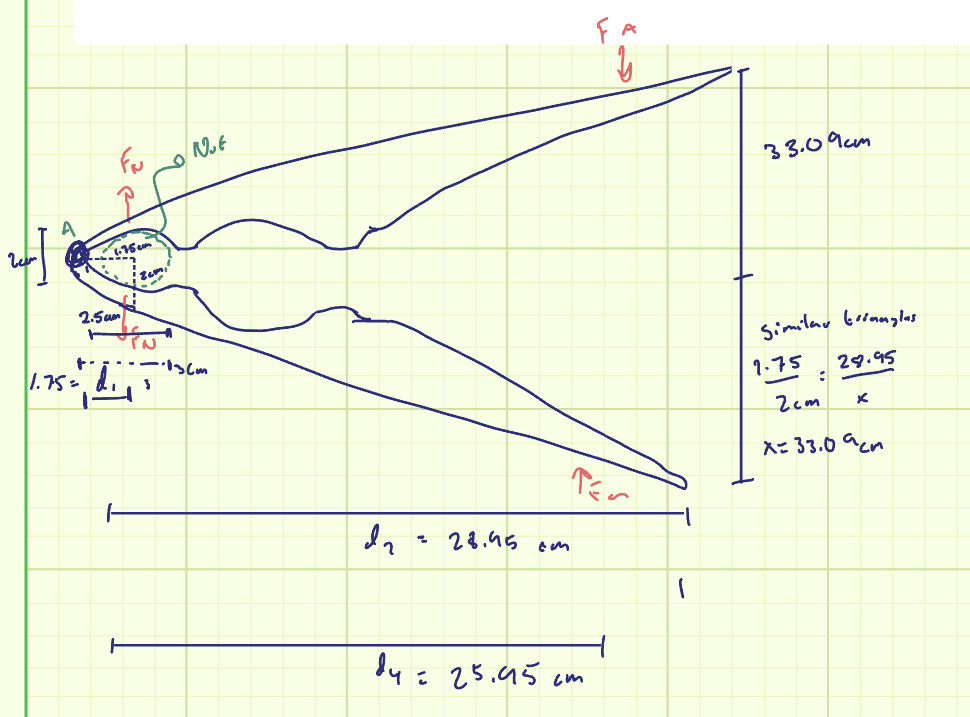

Problem statement and objective: Calculate the the Dimensions of a simple lever Nut Cracker needed to produce a high enough mechanical advantage so that the force of human grip strength could crack a macadamia nut.

Constraints and Input Parameters: 
    Force needed to crack a macadamia nut: = 2180N 
        Found in the appendix section of this paper: Schrauf et al. Do capuchin monkeys use weight to select hammer tools, Anim Cogn 11, 413–422 (2008). https://doi.org/10.1007/s10071-007-0131-2
    Macadamia nut size = 20mm on the large side
    Average human grip strength (at age 80-90)= 55.3lbs for men, 42.7 for women. I used 15kg (33lbs) as my grip strength. This is 147N.
Approach: 
    Assumptions: I drew a sketch of the nut cracker, making the "hole" for the nut 2cm (20mm) in radius, and making various other reasonable assumptions: 2.5cm from the center of the pin to the end of the hole that would contain the Macadamia nut, and 2cm from the edge of the nutcracker to the center of the nut (vertically). I took my human grip strength as 147N, and my force needed to crack the nut as 2180 N.

    I then drew a free body diagram of one of the handles, in order to figure out how to find various dimensions. I then set up a moment balance about the pin at the front of the nut cracker and got: M_a = d1(F_n) + d4(F_a), where d1 is the distance between pin A and where the nut contacts the crackers, d4 is the distance between the pin A and the location of the applied force from the hand, F_a is the applied force, and F_n is the force of the nut on the cracker. 

    I took d1 to be 1.75 cm, calculated from my previous assumsions of hole size and distance from hole to pin. I took F_n to be 2180, from the paper attatched above, and I took F_a to be 147N, also listed in my assumsions above. Plugging these values in and solving for d4, I got 
    d4 = 25.95cm. I then added a few centemeters onto this length in order to account for extra length of handle beyond where the hand lies on the handle, and got 28.95cm for the length of the pin A to the end of the handle, which I called d2. In summary, we have d1 = 1.75, d2 = 28.95, and d3 = 25.95.

    To calculate the distance between the handles when the nut is about to be cracked, I used similar triangles. I used the line horizontally from pin A to where the nut touches the cracker, and the line vertically from where the nut touches the cracker to the outside of the nut cracker handle to create a right triangle that would be similar to that formed by the line horizontally through the center of the nut cracker between the handles, and vertically down from one of the handles. I created a ratio of 1.75cm/2cm = 28.95cm/x, and solved for x. This gave me 33.09 centemeters This is only half the width, so multiplying by 2 gives approximately 66cm.

Diagram: 

Usability: The nut cracker is around a foot long, and the space between the handles is over two feet. Thus this design is not only unweildly, but also impossible to grip with one hand.
